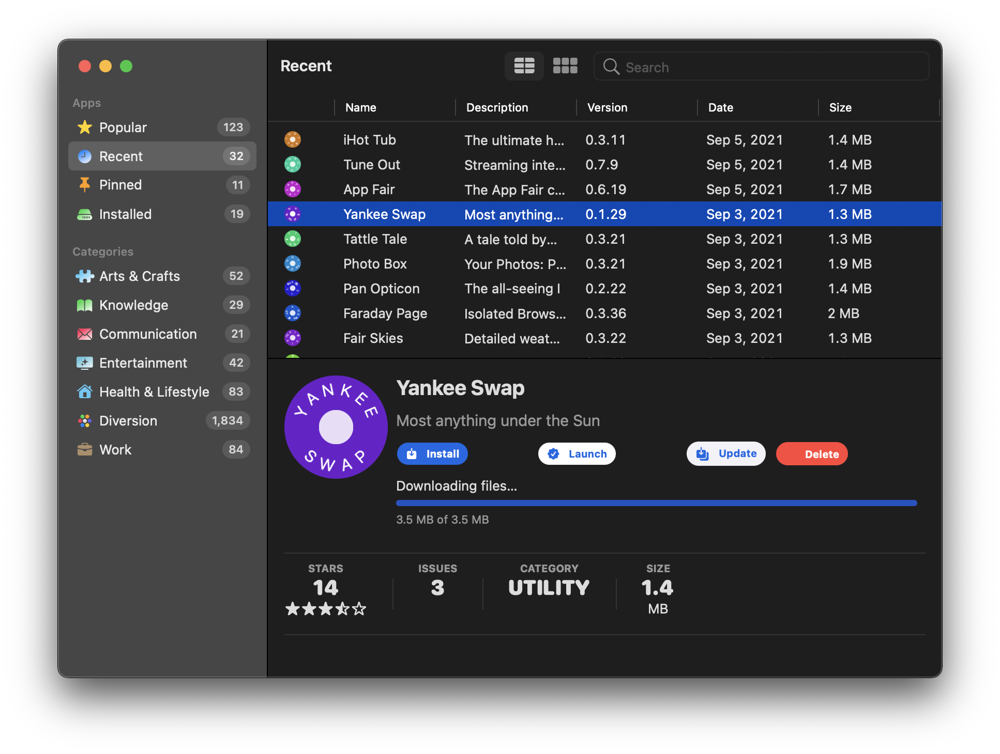
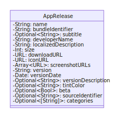
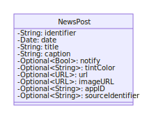

# Welcome to the App Fair


The App Fair is an independent app distribution platform for free open-source macOS applications created by students and educators.
App Fair apps use modern native frameworks and user-interface elements with a focus on performance, efficiency, accessibility and inclusiveness.

## The App Fair for App Users

From an end-user standpoint, the **App Fair.app** catalog browser application allows you to research, discover, install, and update applications from an unlimited online collection. 



Apps installed through the **App Fair.app** application are created using the modern platform-native `SwiftUI` framework and built for both Intel and ARM processors, and therefore run faster and use resources more efficiently than a non-native cross-platform application framework.
At the same time, they use modern "Sandboxing" techniques to protect your system and ensure that you are always aware of what actions the apps are permitted to take, such as reading and writing files, communicating over the internet, or accessing your camera, microphone, or other USB & bluetooth devices.
And since they rely on the native frameworks of the system, they tend to be quite small (under 2 megabytes compressed), and so are faster to download and launch than non-native web apps.

### Getting Started

The App Fair catalog browser app can be installed on macOS 12 is by launching `Terminal.app` and entering the following command:

```
bash -c "$(curl -fsSL https://appfair.net/install.sh)"
```

The command will download the latest release zip and install it directly into your `/Applications/` folder.
 From there, you can launch the **App Fair.app** catalog browser application to start searching for apps.
 
As an alternative means of installation, you can download and unzip the [App-Fair-macOS.zip](https://github.com/appfair/App/releases/download/App-Fair/App-Fair-macOS.zip) file directly.
Since the `App Fair.app` app is not "notarized", you will need to first launch it by command-clicking the app and then selecting the "Open…" menu item.
This will have to be done *twice*, both times accepting the warning about launching an un-notarized app.

Note that once you have installed and launched the `App Fair.app` a first time, subsequent updates will take place via the App Fair itself, and you will no longer need to perform any special steps to launch the app.

Apps that are installed by **App Fair.app** are placed in `/Applications/App Fair/`.
They can be un-installed using the catalog app itself, or they can be removed using the standard macOS method of dragging it into the trash.

## The App Fair for App Developers

App Fair apps are written in Swift and utilize a native `SwiftUI` user interface. 
Apps target macOS 12 and Swift version 5.5, giving them access to the full power of Swift's async/await concurrency features.

The distribution process for App Fair apps is completely autonomous, instantaneous, and free. 
The only requirement is a GitHub account that is associated with your `.edu` e-mail address.
No additional registration, sign-up, or approval is required in order to start developing and distributing apps for the App Fair.
Apps are built, validated, and distributed using GitHub's free actions for open-source projects, and so can be used at no cost.


## The App Fair fair-ground

The "fair-ground" is the name for the autonomous cataloging service that acts as the reference for app distribution. It handles organization verification, app build validation, and cataloging of all the verified apps.
The "App Fair" is one instance of a fair-ground, and is implemented as a set of GitHub repositories, actions, and policies for cataloging the build artifacts of the app forks.
The configuration for the App Fair is defined primarily in the [appfair/App.git](https://github.com/appfair/App.git) repository, which additionally acts as the base repository to be forked by app developers.

### Introduction: the F-A/I-R process


"Fork-Apply/Integrate-Release" (F-A/I-R) describes the stages of creating, developing, building, and distributing an app.
The "Fork" and "Apply" parts are handled by you, the developer: a fork is created from the base [`/appfair/App`](https://github.com/appfair/App) repository, and in that fork you develop your app.
When you are ready to publish a release, you apply your changes in the form of a pull request (PR) back to the base `/appfair/App.git` repository.
The "Integrate" and "Release" phases are handled by the build host that accepts pull requests from the developer's fork and validates, builds, packages, and releases the installable app.

The integration phases is the trusted core of the "fair-ground" process.
This phase handles accepting incoming pull requests to validate, build, and package an app.
The `integrate` phase is where usage policies are enforced (to the extent permissible by automation) and where security entitlements are verified.
Finally, the app is packaged, signed, and archived.

The final phase, the `release` phase, involves the cataloging of the artifacts from the `integrate` phase and making that catalog available to a compliant catalog browser application (such as the macOS **App Fair.app** catalog browser application).

From an App developer standpoint, an App Fair app is a Swift application that is defined by a Swift Package Manager `Package.swift` file, and that uses of two source code repositories: *Fair* & *App*:
 - [https://github.com/appfair/App.git](https://github.com/appfair/App.git) is the repository that is forked to create a new  App Fair app; PRs submitted to this repository are automatically built and released to the **App Fair.app** catalog.
 - [https://github.com/appfair/Fair.git](https://github.com/appfair/Fair.git) is the runtime `SwiftUI` library that is included in every App Fair project, and acts as a sandboxed container within which your application is run. The `Fair` library is the only required dependency (and the library itself has no other dependencies) for your app's [https://github.com/appfair/App.git](https://github.com/appfair/App.git) fork.

## The Integrate pull request

Upon submitting a [pull request](https://docs.github.com/en/github/collaborating-with-pull-requests/proposing-changes-to-your-work-with-pull-requests/about-pull-requests) for your `/APP-ORG/App.git` fork's changes, your project will be automatically built, signed, and packaged as a native macOS application.

These releases can be browsed, searched, and installed using the macOS the **App Fair.app** catalog browser application, which acts as the hub for discovering, researching, installing, and updating apps.

The process is completely automated, instantaneous, and free. 
Provided you have a free GitHub account, no additional registration, sign-up, or approval is required in order to start developing apps for the App Fair.


## The Structure of an App Fair app


### App Organization 

Your App's name is represented uniquely by a GitHub Organization, so the first step is to [create a new free organization](https://github.com/account/organizations/new). 
The App's organization name must be a two word string consisting of 3-12 URL-safe (i.e., ASCII) letters and separated by a hyphen (e.g., "App-Fair").
For example, the GitHub organization for the **App Fair.app** catalog browser application itself is [https://github.com/App-Fair/](https://github.com/App-Fair/).

Your app organization can be structured however you want, and can consist of a team of as few or as many as you like. 
You can manage create and distribute multiple apps by creating multiple separate uniquely-named organizations.

### App Repository

Once your organization is set up, you create your your `/APP-ORG/App` project by forking the [https://github.com/appfair/App.git](https://github.com/appfair/App.git) repository into your new organization name.
This is a Swift project that contains the shell of a cross-platform `SwiftUI` app that you will use as your starting point.

Your app will exist in a top-level repository named "App"; it must continue to be called "App", since that is how the catalog browser will be able to access your project metadata.

For more information on the fork process, see: [Working with forks](https://docs.github.com/en/github/collaborating-with-issues-and-pull-requests/working-with-forks).

<!-- 

XXX ### Developing with an IDE

XXX ### Parts included in integration

XXX ### Developing as a Swift package

XXX ### Handling Versioning

I-R requires increasing build number and semantic version.

XXX ### Translating and Localizing your App

 -->


### Developing your `/APP-ORG/App.git` fork

The `/APP-ORG/App.git` repository is structured as a standard swift package, and includes the following code that must be included as the scaffold and starting point for your app:

  * Package.swift
  * Sources/App/AppMain.swift
  * Sources/App/AppContainer.swift
  * Tests/AppTests/AppTests.swift

In addition, at the top level of the repository, there are `Xcode`-specific project files that describe the metadata, build rules, assets, and permissions for the project:

  * `App.xcworkspace` – Xcode workspace file for running and debugging your app
  * `project.xcodeproj` – internal project file; you should not open this directly, but instead work with `App.xcworkspace`
  * `Info.plist` – metadata about your app containing the name, version and build numbers, and information about what files and URL schemes it can handle
  * `Sandbox.entitlements` – permissions that should be granted to your app
  * `Assets.xcassets` – the app's icon and tint color definition

App development must be done by opening `App.xcworkspace` using `Xcode.app` to build, run, and debug the `SwiftUI` app that is defined in `Sources/App/AppContainer.swift`.
Note, however, that changes to these project files, `App.xcworkspace` and `project.xcodeproj`, will *not* be incorporated into the final project.
It will be best not to make changes to the project files themselves, since none of the changes will be used in the eventual `integrate-release` phases of the process.
Specifically, your build must not rely on any script build phases that you add to the project files, since these scripts will not be run during `I-R`.

When adding project files, they should be added directly to the `App` Swift package's `Sources/App/` folder or a sub-folder that you create.
Localizable resources (such as `.strings` files containing translations of your app into different languages) should be placed beneath `Sources/App/Resources/`, which is the folder that will be pre-processed and flattened as part of the build process.
Resources files that need to retain their directory structure should be instead placed in the `Sources/App/Bundle/`.
These resource bundles will be available at runtime by referencing the `Foundation.Bundle.module` accessor, and then using standard `Bundle` API to load resources. 

### Managing dependencies in your `/APP-ORG/App.git` fork

The `Package.swift` file that defines how your package is built.
You can add anything your want to your `Package.swift` manifest, but note that the fair-grounds validation process has some requirements:

  1. The initial dependency must be for the `main` branch of the `Fair.git` project, and it must appear as the first dependency for the `App` target
  2. The app target names must remain unchanged.
  
This restriction is enforced by the `Integration` phase of the process, which will refuse to build the project if the `Package.swift` manifest is invalid.
You can preview this validation with your own project by replacing `App-Org` with your app name and running:

```shell
swift run -- fairtool validate --verbose true --hub github.com/appfair --org App-Org --project .
```


### AppContainer.swift and AppMain.swift

The `Sources/App/AppMain.swift` is the entry point to your app on all available platforms.
The contents of the file must not be changed, or validation of your project will fail at the `integrate` phase.

To customize your app, you should instead start by editing the `AppContainer` extension in `Sources/App/AppContainer.swift` to provide the required protocol implementations for your app's root view.

### The Fair Library

The [https://github.com/appfair/Fair.git](https://github.com/appfair/Fair.git) repository is the cornerstone for the App Fair.
Fair contains the code for the following aspects of a fair-ground:

  1. Managing the fair-ground process (app validation and catalog management) using the `fairtool` executable target running on the fair-ground's build host
  2. Serving as the canonical source for the contents of the fair-ground's base repository, such as the App Fair's at: [https://github.com/appfair/App.git](https://github.com/appfair/App.git)
  3. Acting as the point of entry to an app's launch, thereby providing automatic runtime features such as integration with the fair-ground's catalog management and runtime security checks

All apps distributed through a fair-ground such as the App Fair much include the HEAD of the `Fair` library as their initial dependency.
This ensures that all integrated apps are always up-to-date with respect to feature improvements, bug fixes, and security enhancements that may be made to the container environment.
This requirement is enforced during the `integrate-release` phase

### The App Fair sandbox

The "sandbox" is the name for a security environment within which a program is run that restricts the capabilities of the software.
Your `/APP-ORG/App.git` fork is pre-configured to request minimal permissions, and thus runs in a very restrictive sandboxed environment: USB & bluetooth hardware access is not permitted, network access communication is blocked, and file access outside the app's own sandboxed container is not allowed.

You may add new entitlements to your `/APP-ORG/App.git` fork's `Sandbox.entitlements` file.
For each entitlement that is requested, a description of the reason for the entitlement must be added to a `FairUsage` dictionary in the `Info.plist`.
The description's key should be the same as the key of the entitlement.
For an example, see the base [Info.plist](https://github.com/appfair/App/blob/main/Info.plist) file.

The presence of the `FairUsage` key is enforced by the `Integration` phase.
These descriptions should be plain language explaining why the app needs access to the specific permissions.

The descriptions will be presented to the user via the **App Fair.app** catalog browser, and the user will need to confirm that the app should be granted these permissions.
The apps may periodically remind the users of the permissions that have been granted to the app, and re-confirm with the user that the app should be granted the permissions.
This is in addition to automatic confirmations and re-confirmations that the host OS may present to the user over time.

For these reasons, you should not request permissions that your app does not need.
The fewer entitlements the app is granted, the safer app will appear to be to users, and they are more likely to trust and install your app.
For example, if you are making a stand-alone utility or game, you will often not need any entitlements at all.

## Continuous Integration

The built-in `fairground.yml` workflow can automatically build your app in the cloud, eliminating the need for dedicated build infrastructure.
Since GitHub Actions are free for open-source repositories, your `/App.git` fork will be able to verify that every commit continues to create a build-able and tested application.

Once the developer enables the `Actions` for their `/App.git` fork, the GitHub workflow defined in the `.github/workflows/fairground.yml` file of the fork will become active.
The workflow will build and test your app every time you commit to the `main` branch.
You should avoid customizing the `fairground.yml` workflow itself, since that file may be verified during `I-R`.

## Creating Releases

In addition, if you commit a tag with a semantic version that matches the version in your `Info.plist`'s `CFBundleShortVersionString` property, a release will be created with the build's artifacts, and will becoming available in your app's `/releases` root.

The developer has complete control over their app's own releases, and they can add, remove, hide, or mark as drafts or pre-releases any release in any of their forks.

### Release Artifacts

The `/App.git` fork's `/releases` page contain all the releases of the app that will be available to the **App Fair.app** catalog browser.
The artifacts contain the application binaries that will be installed on the end-user's device.

The release artifacts also include a number of other metadata related to the app:

  * `App-Name.png`: the app's icon
  * `App-Name-macOS.zip`: the macOS application packaged in a zip file
  * `App-Name-iOS.ipa`: the iOS application packaged in a zip file
  * `App-Name-macOS.plist`: the metadata about the macOS application, such as the title, version, and entitlement descriptions
  * `App-Name-iOS.plist`: the metadata about the iOS application
  * `Sandbox.entitlements`: the list of permissions the app will request, such as network or file system access
  * `App-Name-source.tgz`: the complete source code of the integration PR as well as all the resolved SPM dependencies that were used to create the release
  * `Package.resolved`: the release versions of all the resolved SPM dependencies

(Note that in addition to these artifacts, GitHub also automatically includes a "Source code (zip)" and "Source code (tar.gz)" archive in the releases; these are 'shallow' source archives without any resolved dependencies and so it not a complete archive of all the code that was used to build the app. This is why the generated `App-Name-source.tgz` release artifact is generated).


## Integration-Release pull requests

Once a [release](#creating-releases) has been successfully created and publicly available, it becomes eligible for inclusion in the App Fair's catalog.
The mechanism by which releases are communicated to the cataloging process is by opening (or re-opening) a pull request from the developer's `/App.git` fork.
This PR will not ever be merged in the base repository; rather, it acts as a trigger to initiate the `Integration` and `Releases` phases of the App Fair process, and as a mechanism for tracking the status of the catalog request.

The cataloging process, which is run with the permissions if the base `/App.git` repository, checks out the fork's PR changes. 
After validating that the organization is valid (issues & discussions enabled, etc) and that the secure portions of the project (e.g., the `project.xcodeproj` and `Sources/App/AppMain.swift` files) haven't been tampered with, it will build the project using the Swift Package Manager's sandboxed build system.

If the app passes validation and is built successfully, the resulting release artifacts are then compared to the release artifacts that were built and released in the `/App.git`'s forked repository.
If these release artifacts match the artifacts from the `/App.git`'s forked repository's release, then the fork's artifacts will be considered "trusted", and the base fair-ground will publish the `fairseal` (a SHA-256 hash of the fork's validated release artifact) for that fork's release, thereby making it eligible for inclusion in the fair-ground's catalog.

The **App Fair.app** catalog browser will validate that any app that it downloads has a valid `fairseal`, which demonstrates that the app that was downloaded is exactly the same as the app that passed the validation process.

Once this process has been completed for an initial release of the app, the pull request can either be closed or left open.
The decision of which to do is up to the developer, and the choice has the following effects:

### Keeping Open the Integration-Release PR

If the Integration-Release pull request is left open after a tagged release has passed integration, the PR will continue to be automatically updated whenever commits are pushed to the branch that opened the PR.
This means that every time a commit is pushed, a new release process will be attempted, so you should only commit to the PR's branch when a release is ready to be made.

### Closing the Integration-Release PR

Closing the Integration-Release PR will have no effect once the release has been validated and the `fairseal`s for the release artifacts has been published.
Once the developer is ready to create another new release, they can simply open a new PR with their changes for the new release and the `Integration-Release` process will begin anew for the new release.

### Following the status of the Integration-Release request

Once the Integration-Release PR has been created, you will see a status update at the bottom of the PR:

```
"App F-A/I-R" (pull_request_target) In progress — This check has started... (Details)
```

Clicking the `details` link will show a live log of the `Integration-Release` process for the base `/App.git` repository.
If `I-R` fails, you can reference these action logs to see the error that may have occurred.
Most frequently, failure is a result of either a configuration problem (discussions or issues not being enabled), or a formatting issue (e.g., Info.plist's `CFBundleShortVersionString` version not matching the current release tag), or else simply a build error.

Errors with the `fairseal` process can be more challenging to debug, because validation will fail if there is *any* difference between the fork's release artifacts and those artifacts that were generated by the trusted fair-ground's validation process.
The fair-ground system relies on build artifacts being exactly (byte-by-byte) reproducible.
This is the only way to ensure that the untrusted fork's release artifacts conform to the structure and security, disclosure, and sandboxing rules imposed by the fair-ground.


# The App Fair Catalog

## App Fair Catalog Requirements 

The "App Fair" catalog is the list of valid app releases at [appfair/App releases](https://github.com/appfair/App/releases) cross-referenced with the metadata for the `App/` forks: issues, discussions, support info, wikis, project web site, etc.
This metadata is accumulated using the public GitHub APIs, and the generation in the catalog is automated.
It is typically generated after each successful `integrate-release` phase, but it can also run on a scheduled basis to re-validate catalog entires and ensure that only valid entries are included in the list of available apps.

### Org Requirements

In order for an organization's `/APP-ORG/App` project to be visible in the **App Fair.app** catalog, it must be a public organization with at least one public member. 
The organization must have a repository (or redirection) named "App" (literally), which must be a fork of the [appfair/App.git](https://github.com/appfair/App.git) repository.
In addition, the repository must have issues & discussions enabled, and also must be public & un-archived.
Finally, the `APP-ORG` organization's public contact must be a valid e-mail address ending in ".edu".

### Licensing

The [appfair/App.git](https://github.com/appfair/App.git) repository is licensed under the GNU AGPL, which means that all forks of the project are also covered under that license. 
If you would like your app's code to be licensed differently, you can create a separate repository (either in the same organization or elsewhere; it merely needs to be publicly available on GitHub) with another license of your choosing, and then reference the project(s) from your `Package.swift` dependencies section. 
The App/Fair release process doesn't perform any validation of the licenses of any Swift dependencies; it only requires that the license for the forked `/App` project itself remain unchanged, and that all the source files that act as inputs to the build process are available for inspection and analysis at the time of building.

## Catalog Format

The App Fair "catalog" is simply a JSON file located at [https://github.com/appfair/App/releases/download/catalog/fairapps.json](https://github.com/appfair/App/releases/download/catalog/fairapps.json).
This catalog file is re-generated by the `integrate-release` process after each successful release.
The JSON file is downloaded by the **App Fair.app** catalog browser application, and can be used by other catalog apps that conform to the same format.

An example of a single app entry in the catalog JSON follows.

```json
{
  "identifier" : "appfair",
  "name" : "appfair",
  "apps" : [
    {
      "name" : "App Fair",
      "developerName" : "appfair",
      "bundleIdentifier" : "app.App-Fair",
      "version" : "1.0.0",
      "localizedDescription" : "The App Fair catalog browser app",
      "size" : 1161843,
      "versionDate" : "2019-04-04T21:45:44Z",
      "iconURL" : "https://github.com/appfair/App/releases/download/App-Fair/App-Fair.png",
      "downloadURL" : "https://github.com/appfair/App/releases/download/App-Fair/App-Fair-macOS.zip",
      "screenshotURLs" : [
        "https://github.com/appfair/App/releases/download/App-Fair/…"
      ]
    }
  ]
}
```

The catalog is constructed from the list of all the [forks of the appfair/App.git](https://github.com/appfair/App/network/members) who have passed the `integrate-release` phases and have an [artifact for download](https://github.com/appfair/App/releases) and whose organizations are valid (e.g., have a valid app name and have issues & discussions enabled).
The catalog creation is completely automatic.

Note that the same app will appear twice if it targets multiple operating systems with different binary artifact formats (e.g., `.zip` and `.ipa`).

The full structure of the `fairapps.json` file is:





# Principles of the App Fair

The App Fair is founded on a principle of mutual respect between the software users and the developers of the software.

## Ideal: Free

App Fair apps are always free; there is never any cost to download and install apps from the catalog, nor is there any mechanism for in-app purchases or subscriptions.
All apps on the App Fair are licensed under the [GNU Affero General Public License](https://www.gnu.org/licenses/agpl-3.0.html), thereby guaranteeing that they will be free and fair, forever.

In addition, software creators also have benefit from the creative freedom afforded by a platform with no mercurial gate-keeping, annual corporate developer fees, or capricious terms and conditions.


## Ideal: Fair

A fair-ground is a nexus that enables both sovereignty for creators, as well as agency for consumers.
The App Fair is designed to encourage fairness and respect between software creators (the app developers), software consumers (the users of the app), and the "fair-ground" distribution platform (the App Fair). 

Software creators benefit from the a fair platform without the uncertainly of an opaque and mercurial app review process.
They also benefit from the global reach of a centralized and self-maintaining catalog with the unfettered ability to distribute bug fixes and feature improvements to their users in real time.
In exchange, they commit to publishing all their source code for other developers to scrutinize, improve, and share.

Software consumers benefit from a massive catalog of truly free software.
The [Source Accountability](#source-accountability) feature of the App Fair ensures that a user of the software knows the identity of the creator and has open channels to contact the developer for support.

### Creator-Platform-Consumer Trust Relationship

Any system of software aggregation and distribution involves three groups:

 - Consumers: the end-users of the software. These are the people that use the Platform to find, research, install, and update software on the devices.
 - Creators: the person or people that develop the software designed to be distributed to Consumers via the Platform.
 - Platform: the software processes that handle the ingestion, validation, packaging, cataloging, rating, and distribution of software from Creators to Consumers.

This guiding principles for each separate relationship in this collection is:

 - Creator-Platform: the Creators trust the distribution platform to treat them fairly. Creators should not be advantaged or disadvantaged by hidden rules implemented by the Platform. Creators should have free and unfettered control over how they add, remove, or update apps available in the Platform's catalog.

 - Consumer-Platform: the Consumers trust that the Platform will provide a safe and reliable mechanism to find, research, install, and update software. The Consumers rely on the Platform to ensure that there are reliable and accountable communication channels available for the Consumer to relay questions and concerns to the Creator.
 
## Ideal: Forever

While apps distributed through the App Fair catalog can be removed by their creators at any time, the apps do not otherwise expire.
Once you have downloaded and installed an app, you can be confident that it will remain in its current operational state until you remove or update it.
To this end, the App Fair does not impose any automatic updating mechanism on your apps.
App updates must always be explicitly initiated by the end user.


## App Fair Security

A challenge for any application distribution platform is dealing with "badware", which can be simply defined as software with undesired effects. 
These can be merely annoying and wasteful, such as adware, containers for offensive content, covert proof-of-work crypto-currency miners, and other potentially unwanted programs ("PUPs"). 
Software can also be actively hostile, such as programs that attempt to exfiltrate your personal data and activities ("spyware") or programs that attempt to lock you out of your own data ("ransomware"). 
At the extreme end of the spectrum, programs that run on your computer can be actively dangerous to both yourself as well as the broader network: they can act as hosts for virus propagation or externally-coordinated clients for a "botnet" that can perform distributed denial of service (DDoS) attacks or other malicious activities.

Web browsers have been dealing with these risks and issues ever since the web was born.
Browsers have evolved to enable arbitrary code to be run while still protecting the user's system and privacy (to some extent) by having the untrusted code run inside a sandbox that restricts the sorts of activities that are permitted: file system access is generally restricted to cookie storage and compartmentalized local file storage APIs, and network access is typically limited to HTTP and websocket access back to the network host for the page that loaded the code.

Similarly, applications that run on most modern operating systems can be "hardened" and constrained to running in a "sandbox", which restricts the application in what it can see and do.
File system access, including access to your personal data (such as contacts, mail, and photos), require explicit consent from the user before the app can access the data.
Similarly, direct access to the local hardware (microphone, video/camera, keyboard) is constrained and also requires explicit consent.
The App Fair integration process requires that all software be hardened and sandboxed in order to be visible in, and installable from, the catalog.

### Source Transparency

The App Fair's `integrate-release` build process is completely automated; there is no individual review of apps, neither when they are initially submitted nor when updates are released.
This allows the release & update processes to be free of delays and keeps the catalog free from reviewer bias. 
It also precludes the possibility of any pre-distribution "gate-keeping" to enforce content or policy.

The App Fair instead provides post-distribution accountability by requiring that the source code for the entire app be available to the build process and that it be hosted in publicly-available GitHub repositories.
For any release in the App Fair catalog, the complete source code is available for inspection, review, and analysis by the entire world.
This access enables the security community to use all its resources to identify, isolate, and mitigate badly-behaved apps.
In addition, a requirement that all the code be hosted in publicly-available Git repositories means that tools like [code scanning](https://docs.github.com/en/code-security/secure-coding/automatically-scanning-your-code-for-vulnerabilities-and-errors/about-code-scanning) can be used to identify security vulnerabilities in the app or any of the frameworks it embeds.

### Source Accountability

The App Fair's `integrate-release` build process signs the release's binary artifacts with an "Ad-Hoc" code signing certificate.
While this satisfies the policy requirements of certain platforms and provides some protection against tampering, this ad-hoc signature itself does not confer any useful identifying information.
The signature is essentially an anonymous seal on the binary placed on it by the `integrate-release` build phases.

Instead, the App Fair provides author accountability and identifiability by requiring that any commit that triggers the `integrate-release` process needs to be marked as `verified` by GitHub.
This means that the commit itself is cryptographically signed.
This signature must be associated with an academic e-mail address, and that address must be associated with user's GitHub account.
The academic address does not need to be the primary address for the user, but it does need to be listed in the developer's validated public e-mail addresses at [https://github.com/settings/profile](https://github.com/settings/profile).

The simplest way to sign your PR commit is to simply use the GitHub web interface whenever you update your PR to trigger the `integrate-release` phases.
GitHub will mark any commit that you make using their web interface as being "verified" with whichever of the e-mail addresses you have configured with them.

Alternatively, you can sign commits from the `Terminal.app` using the `gpg` tool, which you can install using `homebrew`.
This will enable you to update your PR from the terminal, but is considerably more complex to set up.
For information on setting up commit signing, see the following documentation:

  * [Signing commits](https://docs.github.com/en/github/authenticating-to-github/managing-commit-signature-verification/signing-commits)
  * [Telling git about your signing key](https://docs.github.com/en/github/authenticating-to-github/managing-commit-signature-verification/telling-git-about-your-signing-key)
  * [Associating an email with your GPG key](https://docs.github.com/en/github/authenticating-to-github/managing-commit-signature-verification/associating-an-email-with-your-gpg-key)
  * [Setting your commit email address](https://docs.github.com/en/github/setting-up-and-managing-your-github-user-account/managing-email-preferences/setting-your-commit-email-address)


Note that only the commit that creates or updates the `integrate` PR is required to be signed.
Commits to the fork's repository itself, or to any third-party dependency repositories, do not need to be signed (although it is always encouraged). 
For this reason, it is the creator of the PR's commit that is considered to be the "author" of the app in terms of validation and accountability.


# Troubleshooting & Frequently Asked Questions

## User FAQ

### Where are App Fair apps installed?

The standard install location for App Fair apps is the `/Applications/App Fair/` folder, which exists as a peer to the `/Applications/App Fair.app` application. 
Storing apps in a sub-folder of the standard `/Applications/` folder prevents naming conflicts with apps installed through other distribution mechanisms.

### Can I revert to an older version of an app?

When **App Fair.app** installs an update to an existing app, it will place the older version in the user's Trash. 
As long as the trash remains un-emptied, the previous version of the app will continue to be available to drag back into the `/Applications/App Fair/` folder.
The App Fair catalog itself only references the most recent version of an app, so you must rely on your own backups (or contact the author of the app) for older versions.
Older releases may additionally be available from the archives saved from the [appfair/App/actions](https://github.com/appfair/App/actions) history; these are typically available for a short time after the release has been created. 

### How can a user delete an app installed with the **App Fair.app** catalog?

Apps can be deleted from the `/Applications/App Fair/` folder by dragging them into the Trash or deleting them directly.

App Fair apps are no different from any other installed app in this regard.


### How does the App Fair compare to other software distribution platforms?

App Fair apps are written in Swift, a modern & safe language, compiled natively for Intel & ARM, and utilize the `SwiftUI` framework to provide a truly native application user interface.
This makes apps installed from the App Fair tend to be fast and efficient, and have the capability to utilize the full range of the platform's native frameworks.

What sets the App Fair apart from other platform-native store-fronts is that there is no application, fees, or recurring subscriptions to create, develop, and update App Fair apps, nor are there any reviews or systematic delays in issuing updates to apps.

## Developer FAQ

### How is the App Fair free?

The fair-ground system is designed for public forks of an open-source base repository. 
This allows them to utilize free GitHub actions minutes and downloadable artifacts for the build, release, and `fairseal` validation phases.
This Swift Package and Xcode cloud based build system allows a user to create and update their app without any paid subscription to any developer services.
It even technically allows for writing and updating an app without having a macOS installation at all, since the online GitHub editor or a plain text editor can be used to modify the app's source code and configuration.

### How do I use git and GitHub?

There are a multitude of resources available online for both `git` (the source control management tool), and `GitHub`, the service that hosts both free and commercial git repositories and provides related services.
A good starting point is GitHub's [Hello World](https://guides.github.com/activities/hello-world/) tutorial.
Fluency with git will be important for managing your app's lifecycle.

### Can I develop an App Fair app with a non-`.edu` academic e-mail address?

While anyone is free to fork the App Fair's [base repository](https://github.com/appfair/App.git), the fair-ground enforces that the committer of the `integrate` PR has an associated academic e-mail address before it will validate the app and publish a `fairseal`, which is a prerequisite for the app to appear in the App Fair catalog.
These addresses are currently restricted to academic `.edu` addresses.

### How do I fork the `appfair/App.git` repository?

Once you have set up your free `APP-ORG` organization that will represent the app, you can fork the repository by going to [https://github.com/appfair/App/fork](https://github.com/appfair/App/fork).
See the GitHub documentation: [Fork a repo](https://docs.github.com/en/get-started/quickstart/fork-a-repo).

### Can I customize my app's icon?

A default icon with your App's name is automatically generated by the `fairtool` as part of the build process if you have not specified your own artwork.
You are encouraged to provide your own original artwork in the `Assets.xcassets/AppIcon.appiconset/` folder.

### Where do I customize my app's name?

The canonical name of your app is defined by the organization name that hosts your `/App/ fork.
This name must conform to the App Fair's naming conventions (two words separated by a hyphen) as well as GitHub's limitations on organization names (URL-safe characters). 

In addition to the canonical `APP-ORG` name, this name must be mirrored in the app's `Info.plist` metadata file.
Specifically, the keys `CFBundleName` and `CFBundleIdentifier` will need to be manually updated in your fork, like so:

```xml
<dict>
    <key>CFBundleName</key>
    <string>App Org</string>
    <key>CFBundleIdentifier</key>
    <string>app.App-Org</string>
    <key>CFBundleShortVersionString</key>
    <string>0.0.1</string>
    <key>CFBundleVersion</key>
    <string>1</string>
</dict>
```

### How do I re-name my app?

See the GitHub documentation on [re-naming an organization](https://docs.github.com/en/organizations/managing-organization-settings/renaming-an-organization).
Note that you will, at a minimum, need to update your new org's `/App.git` fork's `Info.plist` to reflect the new name in the app's metadata.

Also note that a re-named organization will, by definition, also have a new bundle identifier, which will mean that the re-named app will not have access to the sandboxed container of the previous app (since as far as the platform is concerned it is an entirely different and new app).

### Can I change the target and product names from "App" in the project file?

The generic "App" target is used for encapsulating your app as a package.
It is expected that you will configure your app's name in your fork's `Info.plist` metadata file.
This allows your app's fork to easily fork-able itself, which can be used by someone to derive their own variation on the app.
For this reason, the generic name "App" is used for targets and package names throughout the code, and should not be changed.

### What if the name I want is already in use by another GitHub organization?

Pick a new name, or else [see GitHub's advice on the topic](https://docs.github.com/en/github/site-policy/github-username-policy#what-if-the-username-i-want-is-already-taken).

### What is the `fairtool`?

Fairtool is the name of the utility that is included with the `Fair` project, that can be used to validate a project, generate icons, and the like.
It can be run from any `/APP-ORG/App.git` fork from Terminal.app with the command:

```
$ swift run fairtool help
```

For details, see the [source](https://github.com/appfair/Fair/blob/main/Sources/FairApp/FairCLI.swift)

### How can I change the category of my app in the **App Fair.app** catalog?

App categorization is done using GitHub topics.
The various pre-existing topics ("appfair-games", "appfair-utilities", etc.) are used for specifying the category that the app will show up under.
These tags must be mirrored in the `LSApplicationCategoryType` property of your app's `Info.plist` file, with the "appfair-" prefix being renamed to "public.app-category." (e.g., the "appfair-games" GitHub topic should be represented with the "public.app-category.games" value for the `LSApplicationCategoryType` key).


### Can I embed API keys for online services into my App Fair app?

Any "secrets" that are included in your software, such as passwords and API keys, should be considered to be public information.
The App Fair's "Source Transparency" mandate means that every piece of data that goes into the build process of your app will also be available to the users of the app.
The presents a problem for API keys and service passwords, since there is no way to "hide" them in your code.
Sensitive information pushed to open-source repositories, such as GitHub OAuth tokens, personal access tokens, tokens from various cloud service providers, and unencrypted SSH private keys, are routinely scanned, and can be subject to automatic revocation by the organization that hosts the service.

The recommendation is that you not rely on client-side secret data to utilize your application.
When possible, the onus should be placed on the user to acquire their own token, which they can then store in the keychain or application preferences in your app.

### Can I distribute Beta or Demo versions of my app through the App Fair?

There are no restrictions on the kinds of apps that you can build and distribute at the App Fair.
The App Fair welcomes all apps: Student Projects, Experiments, Artistic and Literary works, Vanity App, Demos, Tests, and Re-Mixes of other App Fair apps.
As a completely automated system, there is no human review, so the only requirement to be included in the App Fair catalog is that it passes the automated validation phases of the `integrate-release` process.

Projects and organizations will, however, need to abide by the rules and restrictions of the hosting environment (which, in the case of the App Fair fair-ground, is GitHub).

### How can I set the description of my app in the App Fair catalog

Change the `Description` section of the repository details "About" setting.
This will serve as the description of the 

### How do I provide documentation for my app?

The `README.md` file in your `/App/` fork repository should be used as the entry point to your application's documentation.

### How can I categorize my app in the App Fair catalog

You can classify and categorize your app for the App Fair catalog by adding any two of the following to the `topics` of your `/APP-ORG/App.git` fork's "About" settings.
For more information, see [Adding topics to your repository](https://docs.github.com/en/github/administering-a-repository/managing-repository-settings/classifying-your-repository-with-topics#adding-topics-to-your-repository).

These settings should also match the `LSApplicationCategoryType` property in your `Info.plist` file, with the following GitHub category: property mapping:

 - [`appfair-business`](https://github.com/topics/appfair-business): `public.app-category.business`
 - [`appfair-developer-tools`](https://github.com/topics/appfair-developer-tools): `public.app-category.developer-tools`
 - [`appfair-education`](https://github.com/topics/appfair-education): `public.app-category.education`
 - [`appfair-entertainment`](https://github.com/topics/appfair-entertainment): `public.app-category.entertainment`
 - [`appfair-finance`](https://github.com/topics/appfair-finance): `public.app-category.finance`
 - [`appfair-games`](https://github.com/topics/appfair-games): `public.app-category.games`
 - [`appfair-graphics-design`](https://github.com/topics/appfair-graphics-design): `public.app-category.graphics-design`
 - [`appfair-healthcare-fitness`](https://github.com/topics/appfair-healthcare-fitness): `public.app-category.healthcare-fitness`
 - [`appfair-lifestyle`](https://github.com/topics/appfair-lifestyle): `public.app-category.lifestyle`
 - [`appfair-medical`](https://github.com/topics/appfair-medical): `public.app-category.medical`
 - [`appfair-music`](https://github.com/topics/appfair-music): `public.app-category.music`
 - [`appfair-news`](https://github.com/topics/appfair-news): `public.app-category.news`
 - [`appfair-photography`](https://github.com/topics/appfair-photography): `public.app-category.photography`
 - [`appfair-productivity`](https://github.com/topics/appfair-productivity): `public.app-category.productivity`
 - [`appfair-reference`](https://github.com/topics/appfair-reference): `public.app-category.reference`
 - [`appfair-social-networking`](https://github.com/topics/appfair-social-networking): `public.app-category.social-networking`
 - [`appfair-sports`](https://github.com/topics/appfair-sports): `public.app-category.sports`
 - [`appfair-travel`](https://github.com/topics/appfair-travel): `public.app-category.travel`
 - [`appfair-utilities`](https://github.com/topics/appfair-utilities): `public.app-category.utilities`
 - [`appfair-video`](https://github.com/topics/appfair-video): `public.app-category.video`
 - [`appfair-weather`](https://github.com/topics/appfair-weather): `public.app-category.weather`


### How is e-mail verification performed?

The GPG signature of the initiator of the `integrate-release` pull request must be for an `.edu` e-mail address and the commit must be [verified](https://docs.github.com/en/github/authenticating-to-github/managing-commit-signature-verification/about-commit-signature-verification).

You must have a valid e-mail address configured in your list of keys in your [GPG keys settings](https://github.com/settings/keys), and this is the address that must be associated with the commit that triggers the `integrate-release` process.


### Can I distribute my app using other distribution channels?

You have complete control over how you distribute your App Fair apps.
Your app's binary package can be hosted as a direct download on your web site, which side-steps the need for users to install the **App Fair.app** catalog browser application in order to use your app.
Note, however, that since the app is not "notarized" by default, any direct download will require the user to perform some manual steps in order to launch the app: on macOS, they must right-click (or command-click) on the `.app` file and select "Open…" and accept a warning dialog.
The user must do this **twice** in order to run the app when it has been downloaded directly from a web site.

### How can I monetize my app?

Apps available through the **App Fair.app** catalog browser application are always free.
Activating GitHub sponsorships will enable your account to accept financial contributions to your project through any of the supported funding model platforms.
When sponsorships are enabled, your app's container will automatically add a Help menu link to the sponsorship service.

For more information about enabling sponsorships for your app, see [Displaying a sponsor button in your repository](https://docs.github.com/en/github/administering-a-repository/managing-repository-settings/displaying-a-sponsor-button-in-your-repository).

### How can I remove my app from the App Fair catalog?

You can remove or hide (by marking as a "draft") any releases of your app you do not want to be included in the App Fair.
Note, however, if you have already published multiple releases of the same app, and you remove or hide (via marking as draft) the most recent release, then the next most recent release for which a `fairseal` has been published will automatically be included in the catalog.
This is an intentional feature, and allows you to pull the latest release of your app while still keeping a version of your app available in the catalog.
This means, however, that if you want to remove your app from the catalog by hiding or removing releases, you will need to hide or remove *all* the releases that you have published in order to prevent the app from appearing in the catalog.

The simplest way to remove your entire app from showing up in the **App Fair.app** catalog is to mark your repository or organization as "private", or else archive (or delete) your organization's `/APP-ORG/App.git` fork.

In addition, disabling issues or discussions for your `/APP-ORG/App.git` fork will also have the result of making your app no longer appear as a valid installation candidate in the **App Fair.app** catalog.
Since discussions and issues are required in order to allow users a channel for support questions and other communications, disabling either of these features will remove these apps from the catalog the next time it is generated.

### How can I have someone else's app removed from the App Fair?

As the App Fair's `integrate-release` process is completely automated, there is no mechanism for direct management of, or intervention in, the app release process. 
Each app that is listed in that app's GitHub repository, which is required to have issues and discussions enabled.
You can use these forums to contact the developer(s) of the app.
Organizations that are removed from GitHub will have the effect of removing that organization's app from being visible or installable from the **App Fair.app** catalog.

### What platforms do App Fair apps support?

The integration phase of the App Fair builds and packages all apps for both macOS and iOS, but the **App Fair.app** catalog browser is currently only available for macOS 12 on ARM & Intel processors.

### Can the `.ipa` release artifacts be side-loaded on iOS devices?

Side-loading the `.ipa` build artifacts is not well tested at this time.

### Why do apps need to target both macOS and iOS?

The integration phase of the App Fair process will build your app's fork for both macOS and iOS, even though they are currently only installable using the macOS **App Fair.app** catalog browser application.
All apps must run in both iOS and macOS.

### What are the target OS versions for App Fair applications?

In order to be able to utilize the Swift 5.5 concurrency features (async/await & actors), App Fair apps target macOS 12 and iOS 15.
Note that the [Fair/FairCore](https://github.com/appfair/Fair/tree/main/Sources/FairCore) target is compatible with Swift 5.4 in order to use macOS 11 as the build host.

### Can I build a watchOS or tvOS app?

No. Only macOS and iOS builds are currently supported. 

### Can I use App Fair release artifacts with other distribution channels?

The binaries created by the `integrate-release` phase are standard `.zip` and `.ipa` archives and should be suitable for distributing via any compatible app distribution mechanisms.
The release artifacts at [appfair/App releases](https://github.com/appfair/App/releases) are not restricted in how they are distributed or used.

### Which native frameworks will my app be able to use?

As a native compiled Swift application, App Fair apps can link to any native system framework on their target host.
However, certain frameworks that integrate with online components (typically those that utilize cloud services) will not function at runtime when they are used from apps that are distributed without a paid developer subscription.
For example, online geo-location services (used by the MapKit framework) and speech recognition services (used by the Natural Language framework) are unavailable to apps that are distributed through free channels.

In general, frameworks that only utilize local system resources can be used without issue in App Fair apps.
Note that any frameworks your app depends on must be available on *both* `macOS` and `iOS`, or else conditional build guards must be put in place on your code.

### What kinds of source files can I include with my app?

The App Fair's `integrate-release` process uses the [Swift Package Manager (SPM)](https://swift.org/package-manager/) tool for building both your `/APP-ORG/App.git` fork, as well as all the third-party dependencies.
SPM is focused primarily on the Swift language, but it can be used to build a wide variety of source.
Note that binary dependencies are not permitted in the `Package.swift` build file; the App Fair requires that all source code that goes into the app be available during the build process.

### Do I need to use the Fair library?

Yes.
The App Fair expects that your app will conform to the protocols defined in the `FairApp` library.
Your app must import the `FairApp` module and implement the `AppContainer` protocol.
The App Fair's `integrate-release` process will validate your `Package.swift` file to ensure that the initial dependency for your app is `appfair/Fair`, and that is points directly to the `main` branch. 

### Can I load executable code at runtime?

Except for Just-in-Time compilation, the `Sandbox.entitlements` forbids the dynamic loading of unsigned executable code at runtime.
This is to help ensure the App Fair's "Source Transparency" mandate.

### How large are App Fair apps?

Since they use the built-in native frameworks included with the host OS, App Fair apps are generally smaller than those built with cross-platform technologies that need to embed large components. An App Fair app's download size can be under 1 megabyte. There is a 100 megabyte limit to the size of app that will be deployed in the `integrate-release` phases.

### Do App Fair apps auto-update?

No.
There is no auto-updating feature in the App Fair.
App updates must be installed manually and individually from the **App Fair.app** catalog browser application.
Any changes in entitlements or other security features will require explicit consent from the user before an upgrade will take place.

### Can I have multiple versions of an app released simultaneously?

No.
There is only ever a single active version of your app that is available through the [appfair/App releases](https://github.com/appfair/App/releases) (and, thus, available for installation in the **App Fair.app** catalog). 
Users can revert to previous versions only if they have their own backup or if the older version still reside's in the user's Trash after the upgrade.

### What permissions am I permitted to use in `Sandbox.entitlements`

Your app may request any permission in the `Sandbox.entitlements` with the exception of the following permissions:

 - `*.files.all`
 - `*.cs.allow-unsigned-executable-memory`
 - `*.cs.allow-dyld-environment-variables`
 - `*.cs.disable-library-validation`
 - `*.cs.disable-executable-page-protection`

Note, however, that any permission you request must have a corresponding `usageDescriptionProperties` in the `Info.plist` metadata file explaining to the user (via the listing in the App Fair catalog) why the entitlement is requested.

### Can I change the permissions in `Sandbox.entitlements` for an update?

No. 
When installing an app, users are presented with the list of entitlements that the app will request, such as file or network permissions, or access to hardware devices. 
These permissions are considered fundamental to the trust relationship between the app's user and the app's developer.

Since changing the permissions the app is granted alters the terms of this trust relationship, the App Fair will not update an app whose `Sandbox.entitlements` have changes from the time the app was installed.
Users will need to first manually un-install the app in order to then manually install the updated version of the app in order to get the app with the new entitlements.

### Can I distribute an Electron-style JavaScript app?

The shell of the App you write, including any top-level system menus, must utilize `SwiftUI` views, idioms, and commands.
Embedding a binary framework, such as the Chromium rendering engine and the Node.js runtime that together power Electron apps, is not supported.
However, there is nothing preventing you from embedding any arbitrary native view controller within your app's view hierarchy, such as the `WKWebView` that enables apps to host an HTML5 application within a Safari-like container.
Provided that the entry point to your app is through SwiftUI, you can build and drive the content of the app in any way you want.

### Can I build my App Fair app using Mac Catalyst?

No.
App Fair apps are cross-platform and must use the native user-interface toolkit for their respective platform (AppKit on macOS and UIKit on iOS).
Using the built-in `SwiftUI` views can make this mostly transparent to the developer, but when you need to implement lower-level `*ViewRepresentable` wrappers around native controls, you will need to provide implementations for both `AppKit` as well as `UIKit`.
There are some `typealias`es in `FairAdaptor.swift` that can help ease this process, notably `UXView` and `UXViewRepresentable`.

### Can I build my App Fair app using Qt?

No.

### What does the `Fair` library do at runtime?

The `Fair` library, which is required to be the initial dependency of any app distributed via a fair-ground, handles the launch process of the app.
The `Fair` library exports both the `FairCore` utility module and the `FairApp` SwiftUI container.
This contain adds various Help menus to the app linking to communications forums (such as GitHub Discussions & Issues) by which users can communicate questions and concerns to the developer(s) of the app.
The `FairApp` module also can initiate runtime security checks to ensure that apps are behaving correctly.

### Can I link to a specific version of the `Fair.git` dependency?

No.
You can only specify the HEAD branch (`main`) as the `Fair.git` dependency.
This is the ensure that distributed apps are always up-to-date with respect to security validation features and enhancements to the app's runtime environment.
Since the `FairCore` and `FairApp` modules have no dependencies, these modules are also safe to reference from external dependencies that your app may reference. 
Improvements to these `Fair` modules will be automatically included in any subsequent `integrate-release` processes, and so improvements to this library will immediately be available to see for any fair-ground app developer.

### Do I need a Mac to develop App Fair apps?

*Technically*, no: you could theoretically use any OS to write the Swift code for your `/APP-ORG/App.git` fork.
Since the Integration and Release phases of the App Fair process are all run in the cloud, no client-side build & run activity is required.

In practice, however, to develop anything but the most trivial of apps requires being able to use a modern IDE, debugger, and the ability to run your app locally in order to test and refine the behavior.

### Why is my `integrate` pull request never merged?

Your `integrate` PRs are not intended to ever be merged into the [appfair/App.git](https://github.com/appfair/App/pulls) repository.
Rather, they are required merely to trigger the `pull_request_target` GitHub action that initiates the `integrate-release` phases.

### Are App Fair apps signed?

Yes. 
As of macOS 12, all apps must be signed in order to run on every native architecture.
The same requirement exists for iOS.
The `Integrate` phase of the App Fair process signs the app with an "ad-hoc" signing certificate in order to satisfy this requirement.

### What is "Ad-Hoc" code signing?

When an app is "signed", it protects the app from being tampered with once it has been installed.
When a signature is "Ad-Hoc", it means that there is no identifying information associated with the signature.

### Are App Fair apps notarized?

Although App Fair apps are signed, sandboxed, and utilize the hardened runtime, they are not automatically notarized during the fair-ground's `integrate-release` phases. 

If you have a developer subscription, you are free to notarize the App Fair release binaries for your app yourself, which will enable you to distribute the same binary both via **App Fair.app** catalog browser application and via other distribution channels that may favor or require notarization.
Notarization can be accomplished by adding your signing certificate to your `/App.git` fork's secrets and adding a signing phase that invokes `xcrun notarytool submit staging/App-Org-macOS.zip` to the workflow in the `.github/workflows/fail.yml` file.

Note that notarization tickets should currently *not* be stapled to the build artifact before release upload, since that is known to interfere with the binary artifact validation by the base catalog repository.

### How do I re-name my project?

An App Fair app is defined exclusively by the `App-Org` name of the organization.
If you can change the name of your organization, the new app name will be used the next time you make a release.
If you re-name `App-OrgA` to `App-OrgB`, the old `App-OrgA` will automatically disappear from the catalog.
Note, however, that since the bundle identifier will change from `app.App-OrgA` to `app.App-OrgB`, all the container settings for you app will change, so your users will find that they will not be able to access preferences or resources that were stored in the previous `app.App-OrgA` container.
This is an unavoidable consequence of renaming your project, so it should not be a decision that is undertaken lightly if your app has a significant number of users who may be forced to manually perform migration tasks.

### What files can my app access?

As a sandboxed app, only local container files and a certain set of system files can be accessed without adding the `files.user-selected.read-write` permission to the `Sandbox.entitlements` file and the corresponding `FairUsage` usage description property in the `Info.plist`.
With the `files.user-selected.read-write` entitlement enabled, the normal sandboxing rules for file access will come into effect: users will need to explicitly grant access to files, either using the standard system "Powerbox" open panel, or by actions such as dragging a file onto the app's icon.
Long-term access permissions for files will require that the security-scoped bookmark for URL be persisted by the app and re-used for future access to the file.

### How can I open and debug the app in Xcode?

You can open the `App.xcworkspace` file in `Xcode.app`, which is a workspace that is pre-configured to use your own `/App/` fork's swift package, as well as containing a `project.xcodeproj` file that is necessary for the building and packaging of the app's release artifacts.

All your code, however, must reside in the SPM package itself, which is your `/App/` fork's `Sources/App/` folder.

Do not edit the `project.xcodeproj` folder directly, since it doesn't reference the swift package folder, and thus cannot build on its own without the surrounding workspace. 
Any changes made either to the `App.xcworkspace` or `project.xcodeproj` files will be ignored during the fair-ground's `I-R` phases, so you should avoid making changes there that are meant to be included in the app's eventual build. 
Instead, you should prefer to use the `Package.swift` manifest as well as local resources for the customization of your app's metadata.

Similarly, when adding new files to your project, you should add them directly to the Swift package folders (either using Xcode itself, or by creating the files by other means). 
New files should not be explicitly be added to the Xcode project definition, since the files from the Swift package will be included automatically.
This differs somewhat from pre-SPM app development in Xcode, in that the developer should ignore Xcode's own legacy project file handling in lieu of using the Swift Package Manager's purely-file-based approach.

### What changes can be made to `project.xcodeproj`?

In order to be included in the App Fair catalog, the app is built two individual times. 
The first build is performed in the environment of the fork's own workflow actions, which will use the `project.xcodeproj` definition that is managed by the developer.
The second build is performed in the trusted environment of the base fair-ground, which checks out the developer's fork and also builds it, but only after first discarding the pull-request's modified `project.xcodeproj` in favor of the base fair-ground's `project.xcodeproj`.
A `project.xcodeproj` can contain scripts that could potentially be malicious or circumvent the protections afforded by using the `FairApp` module (sandbox validation, entitlement verifications, etc), and so the fork's untrusted version of the project definition cannot be used in the base fair-ground's environment.

The `fairseal` for an app is the cryptographic (SHA-256) hash that is generated on the binary artifact that is created by the second, trusted build process in the base fair-ground.
Since this hash must match the contents of the actual release download, which is controlled by the fork's developer, in order for the app to be installed, it is *sine qua non* that the contents of the two binaries are identical (minus their signatures & notarization ticket, which are permitted to vary).
So if a discrepancy exists in the developer's `project.xcodeproj` and the base fair-ground's `project.xcodeproj` project definitions that affects the content of the resulting app executable binary, such as alterations to optimization or linker settings, this will cause a mis-match in the generated hashes, and the app release will not be included in the App Fair's catalog.

For this reason, it is advisable that the developer change nothing in the `project.xcodeproj`, and instead customize their build process purely through the `Package.swift` definition, which is permitted to be altered (provided it continues to include the `FairApp` is the initial dependency).

### What can I change in the Package.swift file?

The `Package.swift` for your `/APP-ORG/App.git` fork is expected to conform to the structural conventions of App Fair apps.
As such, the outline of the `Package.swift` file cannot be changed, but some of the elements, such as the package dependencies, can be edited.
These requirements are enforces with a number of `precondition` statements at the end of the `Package.swift` file.
These should not be removed or altered, but the `I-R` phases will add them back in to ensure that any PR contains a valid package structure.

Note that these restrictions only apply to the `Package.swift` in the `/APP-ORG/App.git` fork itself, and not to the `Package.swift` for any dependent packages.
The App Fair does not analyze any of your transitive dependences other than to enforce that they do not include binary targets, so any valid SPM `Package.swift` can be used as a dependency, provided it is available for both `macOS` and `iOS`.

### My app's code mostly resides in an external Package. How can I make a release when only the dependent package has changed?

The App Fair's `integrate-release` phases are triggered by Pull Request that are made from your `/APP-ORG/App.git` fork.
So in order to create a new release, something in your `/APP-ORG/App.git` fork will need to change before a Pull Request can be created.
One possible change to make would be to increment the version of the dependent library in your `Package.swift` file, and use that change to issue the PR.
You can also manually update your open integration PR via the web interface in order to trigger the fair-ground's [pull_request_target](https://docs.github.com/en/actions/reference/events-that-trigger-workflows#pull_request_target) action.

### What prevents malicious apps from being distributed through the App Fair?

App Fair apps are sandboxed, which prevents them from accessing files that are not explicitly granted authorization from the user.
This helps to contain any damage that may be caused by a malicious (or merely poorly-written) application.

Along with this preventative protection, the system also provides multiple independent remedial protections agains bad actors:

macOS includes built-in antivirus technology called "XProtect" for the signature-based detection of malware, which is updated regularly with signatures of new malware infections and strains.

Furthermore, macOS also includes the "Malware Removal Tool" (MRT), which is a process that remediates infections based on automatic updates of system data files and security information. 
MRT removes malware upon receiving updated information, and it continues to check for infections on restart and login.

### Does the integrate phase run an App's test cases?

The `integrate-release` phases of the fair-ground are run in the trusted environment of the base repository by way of a [pull_request_target](https://docs.github.com/en/actions/reference/events-that-trigger-workflows#pull_request_target) GitHub action.
These phases only run a minimal amount of code that is defined by the App fork: the code that is defined in the `Package.swift` file, which is run in the [restrictive sandboxed environment of the Swift Package Manager](https://swift.org/blog/swift-4-0-released/#package-manager-updates).
Since arbitrary code execution could threaten the secure environment of the base repository, and because the fair-ground's build process needs to be able to create and release apps quickly, it does not run any test code for the apps it builds.

Note, though, that your own repository's fork will come with the `.github/workflows/validate_app.yml` workflow file, which *does* run your unit tests in your own forked repository, provided that you explicitly enable actions for the repository.

### How can I report security issues with the App Fair?

There is a reference implementation of an app that behaves as a bad actor at [https://github.com/Badware-Malware/App.git](https://github.com/Badware-Malware/App.git).
The "Badware Malware" app's repository, and the associated issues and discussion forums, is meant to act as a forum for discussions and issues specific to the App Fair implementation and policies.

For security issues related to the underlying platform or operating system (e.g., bugs in the OS that permit apps to break out of their sandbox), refer to the platform vendor's published security disclosure advice for guidance.

### What is the License for the App Fair project?

Both the [appfair/Fair.git](https://github.com/appfair/Fair.git) and [appfair/App.git](https://github.com/appfair/App.git) projects, as well as all forks thereof (including the [**App Fair.app** catalog browser application](https://github.com/App-Fair/)), are licensed under the [GNU Affero General Public License](https://www.gnu.org/licenses/agpl-3.0.html).

### Is my app code required to use the AGPL?

Only the portion of your app contained in your app organization's `/APP-ORG/App.git` fork is required to be covered by the AGPL.
You can develop any portion of your app in a separate repository, which can be covered by any license of your choosing (provided the source code is available during the fair-ground's `integrate-release` phases).


## fair-ground FAQ

### Can I make my own fair-ground?

The "App Fair" is the reference implementation of a fair-ground, using a model of non-commercial open-source projects for academic developers and mandating source transparency and the explicit disclosure of security entitlements.
Alternative fair-ground models are possible by simply mirroring the structure and repositories of the `appfair` organization.
Many of the App Fair's policies are simply flags that can be set on the `fairtool validate` action that is run during the `integrate` phase.
The bulk of the fair-ground's logic, as well as the runtime code for fair-ground integration, is in the [Fair](https://github.com/appfair/Fair) library, which you can customize to handle your own implementation's policies, restrictions, and commerce needs.

## How is the fair-ground's catalog updated?

The "App Fair" reference implementation has a special [catalog release tag](https://github.com/appfair/App/releases/tag/catalog).
This tag is updated with a new `catalog.json` file after every successful `integrate-release` run.
The `catalog.json` file is the manifest of all the current and valid apps that can be downloaded using a catalog browser.
This manifest is generated by the `fairtool`, which uses the GitHub API calls to aggregate the publicly-available information from the release artifacts, fork integrations, and contributor profiles that makes up the distributed collection of available apps.

## Can I run a fair-ground on a self-hosted GitHub runner?

In theory, yes.


<!-- 
## What is the limit on the number of apps in a fair-ground?

The catalog of a fair-ground is limited to 50,000 apps.
When the number of released apps exceeds that number, the 50K most recently-pushed app integrations will be the ones that are included in the catalog.

This limitation is based on [GitHub's API rate limit](https://docs.github.com/en/rest/overview/resources-in-the-rest-api#rate-limiting).
If the fair-ground belongs to a GitHub Enterprise Cloud account, this limit would be increased to 750,000 apps in the catalog.
 -->
 
 
## Troubleshooting

### Debugging a failed integration 

Once you submit your PR your `/APP-ORG/App.git` fork ([/appfair/App/pulls](https://github.com/appfair/App/pulls)), the App Fair's `integrate-release` process is initiated with an action: [/appfair/App/actions](https://github.com/appfair/App/actions).
This process verifies, builds, and tests your app using an action that is outside of your control.
This means that care must be taken to keep the build process working as expected.
Notably, you should not make changes to the template file `Sources/App/AppMai.swift` (where modifications are explicitly prohibited), nor should you make major changes to the Xcode project files (since any changes will be ignored by the `integrate` build process).

When a failure occurs in the `integrate-release` phases, you will typically get an e-mail (contingent on your GitHub notification settings).
The first place you should look is at the log for the [/appfair/App/actions](https://github.com/appfair/App/actions) that corresponds to your PR (which you should title with your App's identifier).
The log will identify most common issues, such as an invalid license or e-mail address.

You can also perform validation of your app by running the `fairtool` yourself.
This utility is automatically included with every app that uses the `FairApp` SPM package.
To validate the package using `Terminal.app` for the current directory of the `APP-ORG` organization name, you can run the following (replacing "APP-ORG" with your organization's name):

```
swift run -- fairtool validate --verbose true --hub github.com/appfair --org APP-ORG --project .
```

This command will check both the structure and contents of the current package, as well as check the proper configuration for the `APP-ORG` project.
Note that this is exactly the same process that the `integrate` phase executes, so using the `fairtool` is a good validation test to run yourself before creating or updating an existing PR.

# Appendix

## Glossary

  * `fair-ground`: A fair-ground is a platform for app distribution. It is the abstract name for the hosted service(s) that provides the resources for the `Fork-Apply-Integrate-Release` process of app ingestion and distribution.
  * FAIR: The `Fork-Apply-Integrate-Release` process summarizes a system whereby developers create apps by fork-ing a fair-ground's base repository and apply-ing their changes to back to the base in the form of a pull request. This is followed by an `integrate` phase that ingests, validates and builds the app, verifies the creator's organization standing, and then initiates a `release` phase that publishes the build artifacts to an app cataloging and distribution system.
  * `Fair.git`: An SPM package hosted at [https://github.com/appfair/Fair.git](https://github.com/appfair/Fair.git) and licensed under the AGPL 3.0 that has targets for both the `Fair` runtime library, as well as the `fairtool` CLI utility.
  * Fair.swift: A Swift 5.5 library that acts as the entry point to all apps that are distributed via a fair-ground; the library provides a container environment with features such as automatic addition of Help & Support menus, as well as runtime validation of security features. All apps distributed via a fair-ground are required to have the HEAD of `Fair.git` as their initial SPM dependency.
  * `fairtool`: An executable tool that is included with the `Fair.git` package, and is thereby included with all apps that link to the `Fair (runtime)`. The `fairtool` utility is used to validate and merge `integrate-release` requests by the trusted fair-ground build process. The tool can also be used to initialize a new fair-ground with template code for a new base repository. The utility can be run with: the command: `swift run fairtool`
  * `fairseal`: the cryptographic hash of the app binary that has been validated by the trusted base fair-ground. This hash must be present in order to an app to be installable by the catalog application, and the hash must match the content of the binary that is downloaded from the app fork's releases page.
  * App Fair: The App Fair is the name of a fair-ground hosted at [https://www.appfair.net](https://www.appfair.net) that uses GitHub as its host for the `fork-apply` (F-A) phases, and uses GitHub Actions for the `integrate-release` (I-R) process and catalog hosting. The App Fair mandates source transparency and comprehensive security entitlement disclosure.
 
 
## App Fair Limitations

The following limitations are configured for the App Fair:

  1. Max App Size: 150mb
  1. I-R frequency: unlimited
  1. Max I-R action time: 15 minutes 
  1. Fork Repository features: Contact Info, Actions, Issues, Discussions
  1. E-mail requirement: *.EDU

  
## App Fair Distribution Checklist

Use this checklist to ensure that your app is set up properly for distribution in the App Fair catalog.


### App Organization

  1. Does your `APP-ORG` name consist of two distinct words separated by a hyphen?
  1. Does your `APP-ORG` consist solely of two distinct words, each of which is 3-12 ASCII letters?


### User Account

  1. Do you have a valid (e.g., `.edu`) e-mail address set and verified in your [email settings](https://github.com/settings/emails)?
  1. Is "Keep my email addresses private" turned off in your [email settings](https://github.com/settings/emails)?
  1. Have you enabled [vigilant mode](https://docs.github.com/en/github/authenticating-to-github/managing-commit-signature-verification/displaying-verification-statuses-for-all-of-your-commits#enabling-vigilant-mode)?
 
 
### Forked `/App` Repository

  1. Is your forked repository *publicly* accessible at: `https://github.com/APP-ORG/App/`?
  1. Is your `/App.git` fork public?
  1. Is your `/App.git` fork not disabled?
  1. Is your `/App.git` fork not archived?
  1. Does your `/App.git` fork have issues enabled?
  1. Does your `/App.git` fork have discussions enabled?
  1. Does your `/App.git` fork have actions enabled?
  1. Does your `/App.git` fork use the same license as the base fair-ground?


### Source Code

  1. Is the project name in `Package.swift` the same as the `APP-ORG`?
  1. Is the `Fair` library the initial entry in your app's dependencies list?
  1. Is the `Sources/App/AppMain.swift` file unmodified from the origin?


### Metadata

  1. Does your app have a version that is a semantic release containing purely numbers and dots (e.g., "1.2.3")?
  1. Does your `Info.plist` have `*UsageDescription` properties for each entitlement sought in `Sandbox.entitlements`?
 
 
### Pull Request

  1. Do you have a pull request open to the base fair-ground for your fork's changes?
  1. Is the title of your pull request: `App-Org`?
  1. Does the version tag of your PR match the version in `Info.plist`?
  1. Is your pull request commit signed and marked as "verified" by GitHub?
  1. Is the e-mail address associated with the commit valid (e.g., an `.edu` address)?
 
### Post Release
 
  1. Did the integrate-release action in the base fair-ground that was triggered by your Pull Request succeed?
  1. Are there any logged errors about failures in `fairseal` generation?
  1. Does the SHA-256 hash of your fork's released `.zip`/`.ipa` binary exactly match the `fairseal` that is contained in the App Fair catalog?
 
## App Fair Badge

You can use the following badge freely on your app's promotional material to link directly to your App Fair catalog entry.
It is advised that you link directly to the version of the badge hosted at [https://www.appfair.net/appfair-free-for-all.svg](https://www.appfair.net/appfair-free-for-all.svg), since that is that resource that will be updated to use the most current version of the graphic and animation.
You can include the App Fair badge with the following HTML:

```

```

<p align="center"></p>

<!-- “When I'm working on a problem, I never think about beauty. I think only how to solve the problem. But when I have finished, if the solution is not beautiful, I know it is wrong.” -- R. Buckminster Fuller -->
